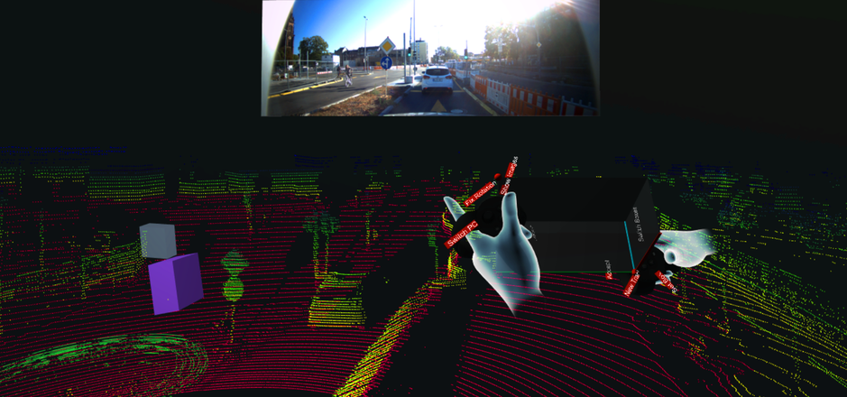
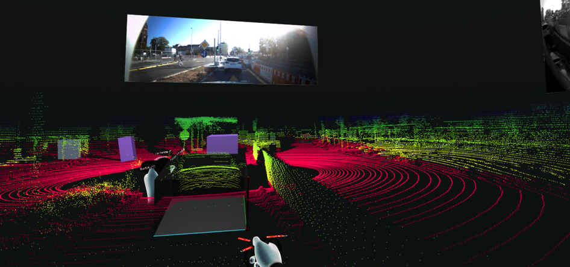
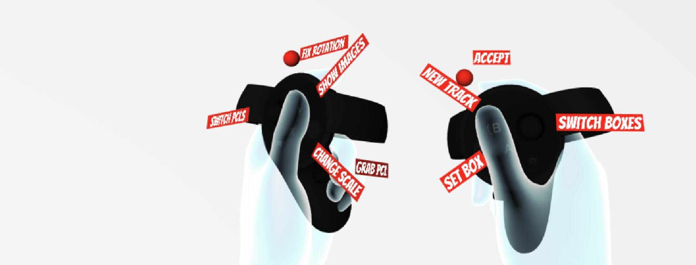

# PointAtMe

#### A 3D Label Tool for Annotating Point Clouds with the Virtual Reality Device Oculus Rift

## Overview

With this 3D Label Tool the user utilizes Oculus VR in order to annotate in 3D point clouds. Originally, the tool was developed for labeling traffic participants, but if could be used for any kind of object. Meta information about traffic participants can be added in-game.

## Installation

1.  Ensure that you have an Oculus Rift device and two Oculus Touch Controllers at your disposal. [Create an account](https://secure.oculus.com/sign-up/) in Oculus and download the Oculus driver [here](https://www.oculus.com/setup/). Make sure to download the program applicable to your Oculus device.

2.  [Create an account in Unity](https://unity3d.com/de/unity/editor) and download the Unity Editor. We recommend using the version Unity 2017.4.8 (this and other versions can be found [here](https://unity3d.com/get-unity/download/archive)) as this was the version used to develop this tool.

3.  Download the files from this repository.

4.  Download Oculus Integration [here](https://developer.oculus.com/downloads/package/oculus-utilities-for-unity-5/1.26.0/) and save the file in a location that you can remember.


## Setting up the Label Tool

1.  Open **Unity Editor** and create a new project. Make sure to use the 3D Template. Give this project a custom name and save it in the desired location. Make sure to remember this location.

2.  Once **Unity Editor** has opened the project you can see a basic unity scene. You should see the tabs **Scene**, **Game** and **Asset Store** just above the basic unity scene. Below and to the left of this scene you should be able to see the tabs **Project** and **Console**. These will be important at a later stage.

3.  Minimize **Unity Editor** and go to the folder where your new unity project is stored. Copy the folders **3DLabelAsset**, **ImportPointCloudAsset** and the file **scene_1.unity** stored in the present repository to the folder **Assets** of your unity project.

4.  Add another folder named **RecordedData** to the **Assets** folder (it’s technically not an asset, it’s just a folder where the recorded data is stored) or download the folder **RecordedData_KITTI** if you want to use our tool plug and play. In the folder **RecordedData** create five further folders named **pcd**, **front**, **rear**, **left** and **right**. Copy the point clouds you would like to use in this tool to the **pcd** folder. Make sure to **only use .pcd files in ASCII format** (There are functions for [matlab (pcread, pcwrite)](https://www.mathworks.com/help/vision/ref/pcwrite.html) or [python (pcl.PointCloud.from_file, .to_file)](http://strawlab.github.io/python-pcl/#pcl.PointCloud)). The remaining folders contain images of the corresponding cameras. Those images are supposed to show the same scene as the .pcd does. They're supposed to help the annotator to find his/her way around the point cloud. **Only use .png files** in these folders. 

5.  Maximize **Unity Editor** again and go to the **Project** tab that you have seen in step 2. Wait a couple of seconds, **Unity Editor** initializes the new folder content and creates .meta files. In the folder **Assets** you should now be able to see `scene_1`. Double click to open this scene in unity. 

6.  You have to change the variable **path**. This can be found in the **Assets** folder of the **Project** tab of **Unity Editor** . To change the variable, you have to click on the folder **3DLabelAsset** -> **Scripts**. Once there, open the script `LabelToolManager`. You must change the variable `path`  (this should be within the first couple lines of code) to match the file location of your unity project. Make sure to end the file location with a `/`  

7.  Finally, to import the asset **Oculus Integration**, go to the menu bar and click on **Assets** -> **Import Package** -> **Custom Package**. Go to the folder where you downloaded the Oculus Integration asset (step 4 of the installation process) and select **OculusUtilities.unitypackage** in the folder **OculusUtilities**. Import all parts of the asset.

8.  If you now hit the `Play` button at the top of Unity Editor, there might be a notification in your Oculus Rift that says that unknown sources currently aren't allowed. To bypass this error, open the program **Oculus** and ensure that you allow unknown sources to run on Rift. You can do this by going to the **Settings** -> **General** and making sure that **Unknown Sources** are allowed.

9.  *Modify **PointAtMe** for your use case:* In the script `LabelToolManager` you can customize a couple of settings:
    1. Change the approximate `RecordingFrequencyRatio` which is defined as .pcd recording frequency / image recording frequency (i.e. 10 Hz / 30 Hz = 0.33)
    2. Change the `scaleFactors` which defines a list of scaling factors you can switch between with the key **X** on the left controller. Those scaling factors will only change the appearance of the point cloud and not the size of the labels relative to the point cloud. The labels will always have the same scale as the point cloud itself. Useful values for `scaleFactors` vary with your use case, though (we recommend to use 2-3 different scaling factors with a ratio of ~3 between them). Choose a scaling factor with which you can comfortably annotate your objects. If the scale of the point cloud is too small, your labels will be imprecise, if it is too small, labeling will be exausting, because you will have to move your arms a lot (ideally, you only need to move your hands a bit). 
    3. Change the `large_jump` that defines how many scenes will be skipped when pushing the left thumbstick up or down. The `small_jump` can also be changed if you don't want to label each point cloud that you have recorded. Usually, we would recommend 10 and 1 as useful values for a start. 
    4. In the script `ShowImages` (that can be found in the same location as `LabelToolManager` from step 6 of the setup process) you can change the variables `ratio` and `Scale` to specify the size of the images shown. It might take a few tries to find an image size that works for you. This step is optional as there is already a standard size the images are set to.    
    5. In the script `PointCloudManager` there are the variables `sensorHeight` and `upperHeight`. The rainbow color scheme can be adjusted according to those parameters. `sensorHeight` defines the height under the sensor that is interesting for you (usually the height of the sensor above the ground) and `upperHeight` defines the height **above the ground**, that is interesting for you. So `upperHeight - sensorHeight` is the height of interest above the sensor itself.
    6. In the script `TurnPointcloud` the variable `speed_mltplr` (speed multiplier) defines the factor between real translatory shift of the controller (when point cloud is grabbed) and the translatory shift of the point cloud itself. Usually this value is way larger that 1 in order to minimize the physical effort when moving the point cloud. 
    
## Safety Instruction

In our tool, we did not include a floor or horizon with which an annotator could oneself. That's why turning the point cloud with 6 DOF might yield to motion sickness or loosing orientation. We therefore recommend to sit down during annotation. Noone can assure your safety if you label while standing. Furthermore, we advise you to make a break every now and then to prevent motion sickness or headache.


## Using the Label Tool

You can start the tool by hitting `Play` in Unity Editor. When you place your Oculus VR over your head, you can see the first point cloud of the sequence around you and might be able to recognize shapes that belong to pedestrians or cars. Make sure to lighten the glasses, otherwise you cannot read the texts and don't see points clearly. Have a look at your controllers. You can also see an estimated shape of your hands around your controllers. We added descriptions of the functionality of each button so you don't have to keep their function in mind. However, we expect any annotator to remember them after a short period of labeling time.



We separated the functionality of the Oculus Touch Controllers in a way we hope is intuitive and well structured. The left controller has functions related to understanding the scene. You can scroll through the sequence, turn the scene or fix the dummy box between your controllers. With the right controller, you enforce the actual labeling tasks. You can set tracks and boxes, choose a track you would like to modify and work yourself through dialogs defining meta information about the traffic participant. Tracks are used to give the user information about the vehicle that is being labeled. 

With the **left hand trigger**, which you can reach with your left middle finger, the point cloud can be "grabbed". If you "hold it in your hand", you can turn and shift it as long as the **left hand trigger** is pressed. Usually you need to press and release it several times in order to find a good position. The speed of translational motion can be modified with the variable `speed_mltplr` that was explained above. Try to familiarize with the scene and turn the point cloud in a way so you can clearly see a traffic participant in front of you. Now press and hold `Y` on your left controller. Up to four images taken in the current scene appear. Make yourself familiar with the scene. Would you understand the traffic rules that apply in the current scene? If not, diving through the sequence may help you in order to do so. Push the **left thumbstick** to the right in order to switch between the point clouds. To go back to the previous scene, push it to the left. Each use of the **left thumbstick** increases or decreases the current sequence index by exactly 1, so it might take a while to have a look at the whole sequence. Alternatively you can push the **left thumbstick** away from you in order to go forward `large_jump`s scenes or pull it towards you to go backwards. 

Now that you understand the traffic scene, press `B` on the right controller in order to create a new track. The New Track Dialog pops up. Choose the options that apply to the traffic participant that you would like to annotate by pushing the **right thumbstick** up or down. If the desired answer is selected, pull the **right index trigger** with your index finger. After answering all questions you can start annotating the first track. The counter in the upper left shows how many tracks you have already created and which track you are currently working on. 

Place both of your controllers in a way so that the reshapeable dummy box between them completely surrounds every point that belongs to the object. The red spheres define two diametrical corners of the box. The coordinate axes that stick to the red sphere on the right controller define the orientation of the box. Your left hand therefore only influences the size and the position of the middle of the box but not the box' orientation. By default, only the yaw angle is released and can be modified. If you additionally want to release roll and pitch angle, press the **left index trigger**. As soon as the box is in the desired position, press `A` on your right controller in order to set the box. Turn the scene to check whether all points are within the box. You can modify a cuboid as long as it is red. If you are not satisfied with its position, place another box at a random position in space to receive a good view onto the points belonging to the object again. Now you can place a box that fits to the object better than the first one. The red box of the currently chosen object is opaque, while the non selected boxes are partly transparent. You should also have a look at the transparent look in order to assess the box' quality.  



Let's have a closer look at the reshapeable dummy box, how it is visualized and how the two red spheres around it define the box. The walls of the box are tinted dark but are still transparent, so you can clearly see whether a point that belongs to an object unintentionally leaves the box towards you. Also, have a look at the symmetry of the points of the object. In some cases the human annotator has to guess the scale of the object and it is recommended to do so by assuming a symmetric shape with respect to the longitudinal vehicle axis. Now go through the whole sequence and look for the object you are currently labeling. Annotate it, until it does not occur in the point cloud any more. The detections do not have to be in every single frame and not even in a closed sequence. If a vehicle disappears behind a truck for example, skip a few frames and keep annotating the object when it appears again. Set a box by pressing `A` on the right controller. After each annotation, you are asked for the quality of the box. 

If you are satisfied with your track, press `B` again and continue with the next track. You can switch between existing tracks by pushing the **right thumbstick** to the left or to the right. The number of the current track in the upper left corner will change accordingly. Labels are saved each time you change the point cloud. If you return to a point cloud where you already annotated objects, these objects will be recreated. If you want to pause the labeling process, just stop the program. As long as you do not touch the `Labels` folder you can restart the programm and continue labeling where you paused. 

## Keys and Their Function

| key | function | 
|-------:|:-------| 
| **left thumbstick** | Push to switch between scenes (left/right: small jump, up/down: large jump) |
| **left hand trigger** | Pull to grab pointcloud. When grabbed, point cloud will follow the movement of your hand  |
| **left index trigger** | Release/Lock two additional rotational degrees of freedom |
| **X** | change the scale of the scene |
| **Y** | show camera images |
| **right thumbstick left/right** | switch between tracks |
| **right thumbstick up/down** | choose answer in dialogs |
| **right index trigger** | accept dialog |
| **A** | set a new box within the current scene |
| **B** | create a new track |




## Citation

If you are using PointAtMe for for research, we would be pleased if you cite our publication:
```latex
@inproceedings{,
  title     = {PointAtMe: Efficient 3D Point Cloud Labeling in Virtual Reality},
  author    = {Wirth, Florian and Quehl, Jannik and Ota, Jeffrey and Stiller, Christoph},
  booktitle = {Proc.\ IEEE Intelligent Vehicles Symposium},
  year      = {2019},
  address   = {Paris, France},
  month     = {June}
}
```


## Contributors

Florian Wirth

##### Student Assistants:

Maqsood Rajput

Konstantin Tsenkov

Justin Knipper
